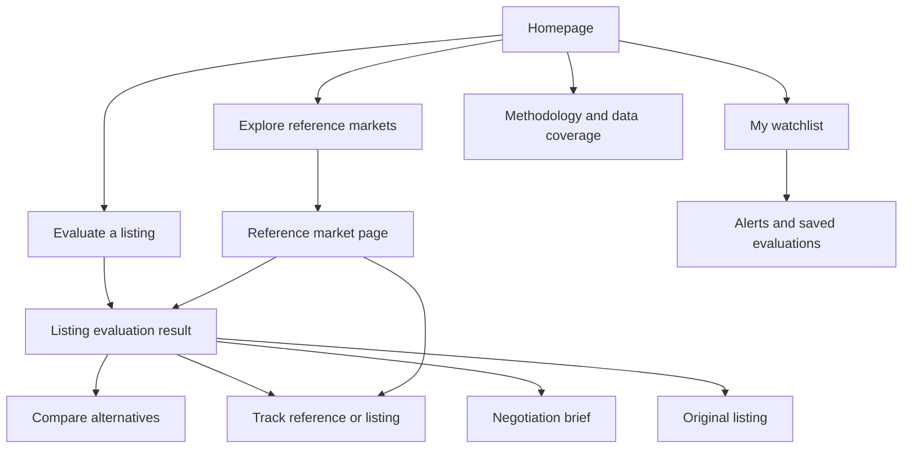
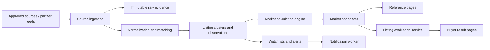

# WatchLedger Pivot — Listing Decision Engine Implementation Plan

## Document purpose

This document defines the product pivot for WatchLedger.

The current product is mainly a **reference-market research site**:

```text
Search a reference → see observed listings → see a range → inspect evidence
```

The new product should become a **decision tool for a specific watch listing**:

```text
Paste a listing URL → understand the exact watch → compare it with evidence
→ calculate realistic total cost → decide whether to buy, save, track, or negotiate
```

This is not a pivot away from reference pages. Reference pages remain essential for search discovery, market research, and evidence. The pivot changes the primary user journey and product promise.

---

# 1. The product pivot

## Current position

> “Know what a watch is worth today.”

This is useful, but broad. Users often need more than an abstract range.

## New position

> “Know whether this exact watch listing is worth considering.”

## Primary user job

A buyer sees a watch for sale and wants an answer to:

> “Should I buy this exact watch at this exact price, from this seller, in my location?”

## The product must answer

1. What exact watch/configuration is this?
2. Is it comparable to the market WatchLedger tracks?
3. Is the asking price below, within, or above the observed comparable range?
4. What is the estimated total cost after shipping, currency conversion, tax, and import assumptions?
5. What is different about this listing compared with cheaper or more expensive alternatives?
6. How strong is the evidence behind the conclusion?
7. What should the buyer do next?

## Product promise

> WatchLedger turns a watch listing into a transparent buying decision, using visible comparable-market evidence and clear limits where evidence is weak.

## Product principles

1. **Evidence before verdict.** Show the comparable set and data quality before making a price label feel important.
2. **Exact configuration before broad model.** Never treat a similar reference as directly comparable without disclosure.
3. **Total cost before headline price.** A cheaper overseas listing can be more expensive after tax and import costs.
4. **Honest uncertainty.** Limited data is a useful result, not a failure state.
5. **No investment hype.** Avoid promises about returns, “true value,” or guaranteed bargains.
6. **User control.** Buyers can select their destination market, assumptions, and comparison preferences.
7. **Public ranking independence.** A dealer can never pay to improve a public price verdict.

---

# 2. Target users and their problems

## 2.1 Buyer / collector — primary user

### Main situation

The buyer already found a listing on a dealer site or marketplace and is considering a purchase.

### Problems

- Cannot tell if the listed watch is genuinely comparable to other watches.
- Does not know whether a lower price is explained by condition, missing papers, location, tax, or seller type.
- Does not know total cost after import duty, VAT/sales tax, shipping, and currency conversion.
- Has too much unstructured information and too little evidence.
- Wants to wait for better inventory but has no market alerting tool.

### WatchLedger outcome

```text
This listing is within the observed comparable range.

It is 2.4% below the typical asking price, includes box and papers,
and has an estimated landed cost of $23,750 in your destination market.

Confidence: Medium
12 unique exact-configuration listings · 4 independent dealers
```

## 2.2 Dealer — secondary user and future data partner

### Problems

- Does not know how stock is positioned against visible competitors.
- Does not know which listing details are missing and reducing buyer confidence.
- Needs an objective pricing monitor without manually checking many sites.

### WatchLedger outcome

```text
Your ask is 8.2% above the typical observed price.

Your listing is complete except for tax treatment and warranty details.
Adding those details will improve buyer comparability.
```

## 2.3 Research collector — secondary user

### Problems

- Wants to monitor a small number of exact references.
- Wants notice when new supply, price drops, or sufficient market coverage appears.

### WatchLedger outcome

```text
Coverage improved for Rolex 126610LN.

WatchLedger now tracks 10 unique exact-configuration listings
from 3 independent dealers and can publish a market range.
```

---

# 3. Scope: what to keep, change, add, and remove

## Keep

- Reference pages as permanent SEO and research pages.
- Exact / variant / related / excluded listing separation.
- Coverage, diversity, freshness, and confidence gates.
- Source evidence and methodology visibility.
- Warm editorial visual language.
- Conservative labels such as `Potential deal`, `Fair price`, `Above comparable range`, and `No published range`.
- Deterministic, reproducible calculation philosophy.

## Change

| Existing concept | New product role |
|---|---|
| Homepage reference search | Homepage listing-evaluation entry point |
| Generic market range | Supporting evidence for a specific listing decision |
| `Track a watch` navigation CTA | Functional watchlist and alert flow |
| Listing table | Comparable evidence module and comparison shortlist |
| Raw source title | Secondary provenance content, not primary table identity |
| “Active listing” | “Listing observed in the latest snapshot” unless directly rechecked |
| Single global price position | Destination-aware landed-cost position when user provides location |

## Add

- Paste listing URL flow
- Listing evaluator page
- Structured manual listing form when a URL cannot be imported
- User destination/landed-cost calculator
- Side-by-side listing comparison
- Watchlist and alerts
- Negotiation evidence brief
- Saved evaluation links
- Dealer listing-completeness audit later
- Public methodology page
- Source and rights registry

## Remove or de-emphasize

- Large raw observed price spreads on limited-data cards
- Generic homepage ranking that treats published and limited markets equally
- Raw source titles as the main listing-table text
- Empty exact-listing tables as the primary zero-data page experience
- “JSON API” as a consumer-facing homepage CTA
- Any copy that implies universal coverage, live verification, true value, or guaranteed bargains

---

# 4. Information architecture



## Primary pages

1. Homepage
2. Evaluate a listing
3. Listing evaluation result
4. Reference market page
5. Compare listings
6. Watchlist and alerts
7. Methodology and coverage
8. Dealer portal — later phase

---

# 5. Homepage implementation

## Primary goal

Get a buyer from “I found this watch” to an evidence-backed evaluation as quickly as possible.

## Desktop layout

```text
──────────────────────────────────────────────────────────────────
Logo              Explore markets    How it works       [Sign in]
                                                [Track a watch]
──────────────────────────────────────────────────────────────────

LIVE WATCH MARKET EVIDENCE

Should you buy this watch?

Paste a supported dealer or marketplace listing URL to compare its price,
configuration, and estimated total cost with tracked market evidence.

[ Paste a listing URL __________________________________ ] [Evaluate]

or

[ Search a reference, model, or nickname ]

Supported sources: partner dealers and approved public sources

                         [Large real watch image]
                         [Example decision card]

──────────────────────────────────────────────────────────────────

What WatchLedger checks

[Exact configuration]     [Comparable asking prices]     [Your total cost]
──────────────────────────────────────────────────────────────────

Published market ranges
[Valid reference cards only]

Coverage developing
[Limited-data reference cards without price ranges]
──────────────────────────────────────────────────────────────────
```

## Mobile layout

Order content as follows:

1. Headline
2. Paste URL field
3. Search alternative
4. Trust note
5. Example evaluation card
6. Published markets
7. Coverage-developing markets

Do not place a large decorative watch image above the input on mobile. The action must appear in the first viewport.

## Required homepage copy

### Eyebrow

```text
WATCH MARKET EVIDENCE
```

### Headline

```text
Should you buy this watch?
```

### Supporting copy

```text
Paste a listing URL to compare its price, configuration, and estimated total cost with tracked public-market evidence.
```

### URL input placeholder

```text
Paste a supported listing URL
```

### Secondary action

```text
Or search a reference, model, or nickname
```

### Trust copy

```text
WatchLedger shows observed asking-price evidence, not guaranteed sale values.
```

## Homepage market sections

### Section one: valid markets

```text
Published market ranges

References with enough independent evidence for an observed comparable range.
```

Valid card:

```text
Rolex Daytona Ceramic
Ref. 116500LN

$21,500–$29,500
Published observed asking-price range

12 unique listings · 4 dealers · Medium confidence
[View market →]
```

### Section two: developing markets

```text
Coverage developing

References WatchLedger is tracking but cannot price responsibly yet.
```

Limited card:

```text
Rolex Explorer II Polar
Ref. 226570

Range not published yet
20 observed records · 1 dealer

[View coverage →]
```

Never show raw low/high spread as a large price result on a limited-data card.

---

# 6. Listing URL evaluation flow

## User input states

### State A — supported source URL

The URL belongs to an approved partner/API source.

```text
Paste URL → resolve source → fetch allowed data → normalize → evaluate
```

### State B — unknown or unsupported URL

Do not silently scrape arbitrary websites.

Show:

```text
This source is not connected to WatchLedger yet.

You can still evaluate the watch by entering the listing details manually,
or request support for this source.

[Enter listing details] [Request source support]
```

### State C — invalid URL

```text
Enter a complete https:// listing URL.
```

### State D — source supported but listing cannot be matched

```text
We found the listing but cannot identify its exact watch configuration confidently.

[Review extracted details] [Search manually] [Track this reference]
```

## Source resolver policy

Only automatically import from sources where WatchLedger has one of these:

1. A licensed API/feed
2. A dealer partnership
3. Explicit source permission
4. An approved public integration that is legally and technically permitted

Never make the product depend on arbitrary scraping as the central user flow.

## Manual listing form

When a URL cannot be imported, allow a buyer to enter information manually.

```text
Brand
Model
Reference
Asking price
Currency
Seller country
Condition
Year
Box included?
Papers included?
Bracelet/strap
Listing URL (optional)
```

Use this manual data only for the user’s private evaluation unless the source is approved and data use is permitted.

---

# 7. Listing evaluation result page

## Primary goal

Give the buyer a clear conclusion, then provide evidence and actions.

## Desktop page layout

```text
──────────────────────────────────────────────────────────────────
Breadcrumb: Home / Evaluate / Rolex Daytona Ceramic

[Listing photo]                 LISTING EVALUATION
                                Rolex Daytona Ceramic
                                Ref. 116500LN · 2021 · Black dial · Full set

                                Seller: Watch Collectors UK
                                Source observed: 3 hours ago

──────────────────────────────────────────────────────────────────

LISTING PRICE                 YOUR ESTIMATED LANDED COST
$24,900                       $26,870
                               Destination: United States

PRICE POSITION
Fair price
8.3% above typical observed asking price

OBSERVED COMPARABLE RANGE
$21,500–$29,500
Typical observed asking price: $23,000

Confidence: Medium
12 unique listing clusters · 4 independent dealers · 83% fresh

[Save evaluation] [Compare alternatives] [View original listing ↗]

──────────────────────────────────────────────────────────────────

Why this listing is priced this way

[Condition and set] [Seller/location] [Market position] [What to verify]

──────────────────────────────────────────────────────────────────

Comparable listings
[filters] [sort] [add to comparison]

──────────────────────────────────────────────────────────────────

Landed cost breakdown

──────────────────────────────────────────────────────────────────

Evidence and methodology
──────────────────────────────────────────────────────────────────
```

## Top verdict card

The card must present the result in this order:

1. Listing price
2. Landed-cost estimate
3. Price-position label
4. Comparable range
5. Confidence and sample quality
6. Actions

## Verdict labels

| State | Label | Background | Text |
|---|---|---|
| Below range with sufficient confidence | Potential deal | `#E6F1EC` | `#1F5B48` |
| Within range | Fair price | `#E8F0F4` | `#36566C` |
| Slightly above range | Above comparable range | `#FCF1DC` | `#A96816` |
| Materially above range | High above comparable range | `#F8E7E7` | `#9B3436` |
| Insufficient evidence | No published price verdict | `#F1F0EB` | `#696862` |

## Required verdict copy

### Potential deal

```text
Potential deal

$620 below the typical observed asking price.
This comparison uses 12 unique exact-configuration listing clusters
from 4 independent dealers.
```

### Fair price

```text
Fair price

This listing is 2.4% below the typical observed asking price
and remains within the comparable range.
```

### Above range

```text
Above comparable range

This listing is 11.3% above the typical observed asking price.
Review the condition, completeness, warranty, and landed cost before deciding.
```

### Limited data

```text
No published price verdict

WatchLedger does not have enough independent exact-configuration evidence
to classify this listing responsibly.
```

Never show “deal,” “fair,” or “above market” where the market fails eligibility gates.

---

# 8. Landed-cost calculator

## User problem

A headline listing price is not the actual buyer cost when currency conversion, shipping, taxes, duty, and insurance are considered.

## Inputs

Required:

- Listing price
- Listing currency
- Seller country
- Buyer country

Optional:

- Buyer state/province/postcode where tax rules require it
- Shipping estimate
- Insurance estimate
- Payment method/fee estimate
- Tax already included toggle

## Output

```text
Estimated landed cost

Listing price                 $24,900
Currency conversion estimate      $0
Shipping estimate               $150
Estimated import duty          $1,245
Estimated tax                  $1,870

Estimated total cost         $28,165
```

## Required disclaimer

```text
This is an estimate based on your selected destination and available listing data.
Final duty, tax, shipping, insurance, and payment fees must be confirmed before purchase.
```

## Backend rule

Every calculation must record:

```text
landed_cost_assumption_set
  destination_country
  destination_region
  tax_included_status
  fx_rate
  fx_timestamp
  duty_rule_version
  tax_rule_version
  shipping_estimate
  calculated_at
```

Do not overwrite this data. A saved evaluation must remain reproducible using its original assumptions.

## User interface rule

Keep headline price and landed cost visible together. Do not bury landed cost in a lower section.

---

# 9. Comparable listings and comparison mode

## Comparable table requirements

Every listing must show structured comparison facts, not only the raw source title.

```text
Rolex Daytona Ceramic
Ref. 116500LN · 2021 · Black dial · Full set
Excellent · Stainless steel · 40 mm

$24,900
2.4% below typical
Fair price

Watch Collectors UK
United Kingdom · Observed 3h ago

[Add to comparison] [View analysis]
```

## Required filters

- Exact configuration / variants / related / excluded
- Destination region
- Seller country
- Condition
- Box and papers
- Year
- Material
- Bracelet/strap
- Price
- Tax status
- Seller/dealer
- Freshness
- Availability

## Required sorts

- Best value by price position
- Lowest headline price
- Lowest estimated landed cost
- Closest to typical asking price
- Most recently observed
- Highest data completeness
- Newest listing

## Comparison page

Allow users to compare up to three listings.

```text
                        Listing A        Listing B        Listing C
Price                   $22,000          $23,400          $24,900
Landed cost             $25,120          $23,400          $26,300
Price position          Potential deal   Fair price       Fair price
Condition               Excellent        Excellent        Unworn
Box                     Yes              Yes              Yes
Papers                  Yes              Unknown          Yes
Year                    2021             2022             2023
Warranty                No               Yes              Yes
Location                UK               US               Germany

Lowest landed cost      —                ✓                —
Best evidence           —                ✓                —
```

## Comparison summary copy

```text
Decision summary

Lowest headline price: Listing A
Lowest estimated landed cost: Listing B
Best data completeness: Listing C

WatchLedger does not choose for you. It shows the trade-offs using available evidence.
```

---

# 10. Negotiation brief

## Product purpose

Buyers need objective, respectful evidence to discuss a price with a seller.

## Eligibility

Only show a negotiation brief when:

- The listing has a valid price verdict
- The comparable set passes market eligibility gates
- The listing is above the typical observed price or above range

## Page content

```text
Negotiation evidence

Seller asking price: $31,500
Typical observed asking price: $23,000
Observed comparable range: $21,500–$29,500

This listing is 37.0% above the typical observed asking price.

Comparable evidence
• 3 comparable full-set listings below $25,000
• 2 examples from the same production period below $26,000
• The selected listing has no documented feature explaining a large premium
```

## Suggested buyer copy

```text
Comparable full-set examples are currently observed between $21,500 and $29,500.
Is there flexibility in the asking price given the current comparable market?
```

## Do not say

- “The seller is overcharging.”
- “This listing is a rip-off.”
- “You should offer exactly X.”
- “The watch is worth exactly X.”

---

# 11. Watchlist and alerts

## First product loop

A visitor evaluates a listing or reference, saves it, and returns when the market changes.

## Save actions

```text
[Save this listing]
[Track this reference]
[Save comparison]
```

## First alert types

1. New exact-configuration listing
2. Saved listing price drop
3. Potential deal appears
4. Published range changes by selected threshold
5. Market moves from limited data to valid range
6. Listing becomes unavailable or stale

## Tracking modal

```text
Track Rolex Daytona Ceramic
Ref. 116500LN

Notify me when:

[ ] A new exact-configuration listing appears
[ ] A listing is at least 5% below the typical observed price
[ ] The observed range changes by at least 3%
[ ] Market coverage becomes sufficient for a published range

Email address
[Start tracking]

One-click unsubscribe in every email. No spam.
```

## Authentication approach

Initial version:

- Email-only alert subscription
- Double opt-in confirmation
- Signed magic link to manage preferences
- No password required

Later:

- Full account/profile
- Multi-reference watchlist
- Saved comparisons
- Collection research view

---

# 12. Reference market pages after the pivot

Reference pages remain important, but they become the evidence layer behind listing evaluations.

## Valid reference page

```text
Rolex Daytona Ceramic
Ref. 116500LN · Steel · Black or white dial configuration

Published observed asking-price range
$21,500–$29,500

Typical observed asking price: $23,000

12 unique listing clusters · 4 dealers · 83% fresh
Overall confidence: Medium

[Evaluate a listing] [Track this reference]
```

## Limited-data reference page

```text
Rolex Explorer II Polar
Ref. 226570

No published market range yet

20 observed source records
1 independent dealer
Range not published because source diversity is insufficient.

[Evaluate a listing anyway] [Track coverage] [Browse listings]
```

## Zero-data reference page

```text
Tudor Black Bay 58
Ref. 79030N

No exact-configuration listings currently tracked.

24 broader related listings are available for research,
but they are not comparable enough for a price range.

[Browse related watches] [Request coverage] [Track this reference]
```

## Homepage and reference-page distinction

| Homepage | Reference page |
|---|---|
| Convert intent into an evaluation | Explain the market for one canonical configuration |
| Paste listing URL or search | Inspect evidence, trends, listings, and methodology |
| Promote valid range coverage | Preserve all market states transparently |
| Start tracking | Deep research and comparison |

---

# 13. Visual design system

## Brand feeling

WatchLedger should feel like:

- A premium watch publication
- A calm financial-research tool
- A careful buyer’s assistant

It must not feel like:

- A flashy trading application
- A generic marketplace
- A luxury dealer pushing stock
- A high-pressure “deal” site

## Core palette

| Role | Colour | Usage |
|---|---:|---|
| Page background | `#F7F6F2` | Warm ivory background |
| Surface | `#FFFFFF` | Cards, forms, tables, drawers |
| Primary ink | `#1A1A18` | Headlines, prices, key data |
| Muted text | `#5E5D57` | Supporting copy and metadata |
| Border | `#E6E4DE` | Fine structure and dividers |
| Deep green | `#1F5B48` | Primary CTA, positive evidence, selected state |
| Pale green | `#E6F1EC` | Potential-deal state |
| Slate blue | `#36566C` | Fair-price state |
| Pale blue | `#E8F0F4` | Explanation panels and fair-price state |
| Amber | `#A96816` | Above-range state |
| Pale amber | `#FCF1DC` | Above-range background |
| Berry red | `#9B3436` | High-above-range state |
| Pale red | `#F8E7E7` | High-above-range background |
| Neutral state | `#F1F0EB` | Limited/zero-data state |

## Colour rules

- Green is for a valid favorable price position or primary action only.
- Blue is neutral: it means fair, explanatory, or informational.
- Amber/red must not be used for limited-data states.
- Limited-data state is neutral gray/ivory, never alarming.
- Never rely on colour alone; every state also needs readable text.

## Typography

| Use | Font | Size guidance |
|---|---|---:|
| Marketing/model headings | DM Serif Display | 36–64px desktop |
| Data/UI/body | Inter | 14–16px body |
| Main price/range | Inter, 600 weight | 40–52px desktop |
| Listing prices | Inter, 600 weight | 18–20px |
| Table metadata | Inter | 13–14px |
| Eyebrows | Inter, uppercase | 11–12px |

## Spacing rules

| Use | Spacing |
|---|---:|
| Micro gap | 4px |
| Tight component gap | 8px |
| Input/control gap | 12px |
| Card internal spacing | 16–24px |
| Key card padding | 24–32px |
| Section gap | 56–80px |

## Components

| Component | Rule |
|---|---|
| Button | 8px radius, clear text label, no excessive shadows |
| Input | 10–12px radius, 56–64px primary input height |
| Card | 12–16px radius, thin border, white surface |
| Listing image | 10px radius, neutral placeholder fallback |
| Price badge | Full pill, text plus state, no colour-only meaning |
| Drawer | Side panel on desktop, full-screen sheet on mobile |

---

# 14. Required product copy

## Do use

- Observed asking-price range
- Typical observed asking price
- Potential deal
- Fair price
- Above comparable range
- Listing observed in the latest snapshot
- Seller-reported availability
- Market coverage
- Source diversity
- Evidence behind this range
- No published price verdict

## Do not use

- True value
- Guaranteed bargain
- Best investment
- This watch is worth exactly
- Every listing on the internet
- Verified authentic
- Live price, unless it is directly checked in real time
- Overpriced dealer
- Rip-off

## Limited-data copy

```text
No published price verdict

WatchLedger does not currently have enough independent exact-configuration evidence
to classify this listing responsibly.
```

## Valid-range disclaimer

```text
This range reflects observed asking prices from tracked public sources.
It is not a completed-sale price, authentication opinion, investment recommendation,
or guaranteed purchase value.
```

---

# 15. Backend implementation plan

## 15.1 Keep the deterministic philosophy, change the persistence model

The current proof of concept rebuilds a SQLite ledger from fresh raw files. That is suitable for demos, but insufficient for a buyer decision engine.

The production system needs durable history, user data, evaluation assumptions, alert state, and source permissions.

## Recommended service boundaries



## Required backend responsibilities

| Service | Responsibility |
|---|---|
| Source ingestion | Fetch permitted source/API/feed data; save raw payload and fetch metadata |
| Normalization | Standardise currencies, condition, box/papers, country, seller, configuration fields |
| Matching | Map source listing to canonical reference/configuration with reason and confidence |
| Deduplication | Group likely duplicate records into listing clusters |
| Market engine | Determine eligibility, outliers, weighted range, confidence, and methodology snapshot |
| Listing evaluator | Resolve a supported listing URL or manual input and compare with the proper market snapshot |
| Landed-cost engine | Compute destination-aware estimates with versioned assumptions |
| Alerts | Deliver double-opt-in, unsubscribe-safe notifications |
| Admin/review | Resolve ambiguous matches, duplicate clusters, exclusions, and source-rights questions |

---

# 16. Data model

Use PostgreSQL for durable production data. SQLite can remain useful for local proof-of-concept runs and deterministic fixtures.

## Canonical watch data

```sql
CREATE TABLE watch_references (
  id UUID PRIMARY KEY,
  brand TEXT NOT NULL,
  family TEXT,
  model_name TEXT NOT NULL,
  reference_number TEXT NOT NULL,
  normalized_reference TEXT NOT NULL,
  production_start_year INTEGER,
  production_end_year INTEGER,
  created_at TIMESTAMPTZ NOT NULL DEFAULT now(),
  UNIQUE (brand, normalized_reference)
);

CREATE TABLE watch_configurations (
  id UUID PRIMARY KEY,
  reference_id UUID NOT NULL REFERENCES watch_references(id),
  configuration_key TEXT NOT NULL,
  case_material TEXT,
  dial TEXT,
  bracelet TEXT,
  bezel TEXT,
  case_size_mm NUMERIC,
  production_variant TEXT,
  active BOOLEAN NOT NULL DEFAULT true,
  UNIQUE (reference_id, configuration_key)
);
```

## Sources and rights

```sql
CREATE TABLE sources (
  id UUID PRIMARY KEY,
  name TEXT NOT NULL,
  domain TEXT NOT NULL UNIQUE,
  source_type TEXT NOT NULL,
  access_method TEXT NOT NULL,
  permission_status TEXT NOT NULL,
  image_usage_status TEXT NOT NULL,
  attribution_requirements TEXT,
  terms_url TEXT,
  terms_reviewed_at TIMESTAMPTZ,
  active BOOLEAN NOT NULL DEFAULT true
);

CREATE TABLE source_fetches (
  id UUID PRIMARY KEY,
  source_id UUID NOT NULL REFERENCES sources(id),
  source_url TEXT NOT NULL,
  fetched_at TIMESTAMPTZ NOT NULL,
  payload_hash TEXT NOT NULL,
  fetch_status TEXT NOT NULL,
  response_status INTEGER,
  raw_payload_location TEXT NOT NULL
);
```

## Listings, matching, and duplicate clusters

```sql
CREATE TABLE listings (
  id UUID PRIMARY KEY,
  source_id UUID NOT NULL REFERENCES sources(id),
  source_listing_id TEXT NOT NULL,
  canonical_url TEXT,
  title_raw TEXT,
  price_original NUMERIC,
  currency_original TEXT,
  price_usd NUMERIC,
  tax_status TEXT,
  condition_raw TEXT,
  condition_normalized TEXT,
  box_status TEXT,
  papers_status TEXT,
  year INTEGER,
  seller_name TEXT,
  seller_country TEXT,
  image_url TEXT,
  availability TEXT,
  canonical_reference_id UUID REFERENCES watch_references(id),
  canonical_configuration_id UUID REFERENCES watch_configurations(id),
  match_level TEXT NOT NULL,
  match_confidence NUMERIC,
  match_reason TEXT,
  review_state TEXT NOT NULL DEFAULT 'automatic',
  listing_cluster_id UUID,
  first_observed_at TIMESTAMPTZ NOT NULL,
  last_observed_at TIMESTAMPTZ NOT NULL,
  UNIQUE (source_id, source_listing_id)
);

CREATE TABLE listing_clusters (
  id UUID PRIMARY KEY,
  configuration_id UUID REFERENCES watch_configurations(id),
  representative_listing_id UUID REFERENCES listings(id),
  cluster_confidence NUMERIC NOT NULL,
  cluster_reason TEXT,
  created_at TIMESTAMPTZ NOT NULL DEFAULT now(),
  updated_at TIMESTAMPTZ NOT NULL DEFAULT now()
);

ALTER TABLE listings
  ADD CONSTRAINT listing_cluster_fk
  FOREIGN KEY (listing_cluster_id) REFERENCES listing_clusters(id);
```

## Historical observations

```sql
CREATE TABLE listing_observations (
  id UUID PRIMARY KEY,
  listing_id UUID NOT NULL REFERENCES listings(id),
  source_fetch_id UUID NOT NULL REFERENCES source_fetches(id),
  observed_at TIMESTAMPTZ NOT NULL,
  price_original NUMERIC,
  currency_original TEXT,
  price_usd NUMERIC,
  tax_status TEXT,
  availability TEXT,
  content_hash TEXT,
  UNIQUE (listing_id, source_fetch_id)
);
```

## Market snapshots

```sql
CREATE TABLE market_snapshots (
  id UUID PRIMARY KEY,
  configuration_id UUID NOT NULL REFERENCES watch_configurations(id),
  calculated_at TIMESTAMPTZ NOT NULL,
  methodology_version TEXT NOT NULL,
  state TEXT NOT NULL,
  lower_range NUMERIC,
  typical_price NUMERIC,
  upper_range NUMERIC,
  unique_cluster_count INTEGER NOT NULL,
  source_count INTEGER NOT NULL,
  freshness_percent NUMERIC NOT NULL,
  coverage_state TEXT NOT NULL,
  diversity_state TEXT NOT NULL,
  freshness_state TEXT NOT NULL,
  overall_confidence TEXT NOT NULL,
  input_cluster_ids JSONB NOT NULL,
  excluded_cluster_ids JSONB NOT NULL,
  exclusion_reasons JSONB NOT NULL
);
```

## User evaluation and alert data

```sql
CREATE TABLE users (
  id UUID PRIMARY KEY,
  email CITEXT UNIQUE NOT NULL,
  email_verified_at TIMESTAMPTZ,
  created_at TIMESTAMPTZ NOT NULL DEFAULT now()
);

CREATE TABLE listing_evaluations (
  id UUID PRIMARY KEY,
  user_id UUID REFERENCES users(id),
  input_type TEXT NOT NULL,
  listing_url TEXT,
  listing_id UUID REFERENCES listings(id),
  configuration_id UUID REFERENCES watch_configurations(id),
  market_snapshot_id UUID REFERENCES market_snapshots(id),
  destination_country TEXT,
  destination_region TEXT,
  landed_cost_assumptions JSONB,
  landed_cost_total NUMERIC,
  verdict_state TEXT NOT NULL,
  created_at TIMESTAMPTZ NOT NULL DEFAULT now()
);

CREATE TABLE watchlist_items (
  id UUID PRIMARY KEY,
  user_id UUID NOT NULL REFERENCES users(id),
  configuration_id UUID NOT NULL REFERENCES watch_configurations(id),
  created_at TIMESTAMPTZ NOT NULL DEFAULT now(),
  UNIQUE (user_id, configuration_id)
);

CREATE TABLE alert_preferences (
  id UUID PRIMARY KEY,
  user_id UUID NOT NULL REFERENCES users(id),
  configuration_id UUID REFERENCES watch_configurations(id),
  alert_type TEXT NOT NULL,
  threshold_percent NUMERIC,
  enabled BOOLEAN NOT NULL DEFAULT true,
  created_at TIMESTAMPTZ NOT NULL DEFAULT now()
);
```

---

# 17. Market-calculation engine

## Eligibility gate

A public observed range is published only if all initial gates pass.

| Gate | Initial threshold |
|---|---:|
| Unique exact-configuration listing clusters | 8 minimum |
| Independent dealers/sources | 3 minimum |
| Numeric prices | At least 80% |
| Fresh observations | At least 70% within 72 hours |
| Duplicate clustering complete | Required |
| Outlier review complete | Required |
| Match level | Exact configuration only |

## Processing sequence

```text
1. Select exact-configuration listing clusters.
2. Keep one representative listing per cluster.
3. Reject missing/invalid price rows.
4. Segment by tax state and destination market where possible.
5. Apply configuration, condition, and set-status comparability rules.
6. Calculate median and median absolute deviation.
7. Flag outliers for exclusion/review.
8. Check all market eligibility gates.
9. If eligible, calculate weighted median and weighted percentiles.
10. Save a market snapshot with inputs, exclusions, version, and outputs.
11. If not eligible, save a limited/zero snapshot with explicit failed gates.
```

## Outlier rule

Initial robust outlier calculation:

```text
median_price = median(prices)
mad = median(abs(price - median_price) for price in prices)
robust_z = 0.6745 × (price - median_price) / mad
```

Initial policy:

- Flag absolute robust z-score greater than `3.5`.
- Do not delete the listing.
- Save an exclusion reason.
- Support manual review and restoration.

## Confidence rule

Overall confidence must never exceed the weakest critical dimension.

```text
overall_confidence = minimum(coverage_state, diversity_state, freshness_state)
```

Use ordered levels:

```text
Insufficient < Limited < Medium < High
```

---

# 18. Listing evaluator backend flow

## Supported URL flow

```text
1. User submits URL.
2. Validate HTTPS URL and supported source domain.
3. Resolve source connector.
4. Fetch permitted listing data or identify existing source record.
5. Normalize title, price, currency, seller, configuration fields, and availability.
6. Match to canonical configuration.
7. Find the newest eligible market snapshot for that configuration.
8. Calculate headline-price position.
9. If buyer destination is known, calculate landed cost and destination-adjusted position.
10. Persist evaluation with snapshot ID and assumption set.
11. Render the result.
```

## Unsupported URL flow

```text
1. User submits URL.
2. Domain is not an approved source.
3. Do not scrape automatically.
4. Offer manual listing form.
5. Offer source-support request.
6. Allow private evaluation using manually supplied facts where a market snapshot exists.
```

## Evaluation verdict rules

| Market state | Listing verdict |
|---|---|
| Valid market, price below lower range | Potential deal |
| Valid market, price within range | Fair price |
| Valid market, price moderately above upper range | Above comparable range |
| Valid market, price materially above upper range | High above comparable range |
| Limited or zero market | No published price verdict |
| Configuration mismatch | Not comparable to selected market |

---

# 19. API requirements

Use versioned APIs. Do not expose raw internal fields by default.

## Public endpoints

```text
GET /api/v1/markets
GET /api/v1/markets/{configuration_slug}
GET /api/v1/listings/{listing_id}
GET /api/v1/methodology/{version}
POST /api/v1/evaluations
POST /api/v1/evaluations/manual
POST /api/v1/tracking
POST /api/v1/tracking/confirm
POST /api/v1/tracking/unsubscribe
```

## Evaluation request

```json
{
  "listing_url": "https://approved-dealer.example/listing/123",
  "destination_country": "US",
  "destination_region": "NY"
}
```

## Evaluation response

```json
{
  "evaluation_id": "uuid",
  "state": "valid",
  "watch": {
    "brand": "Rolex",
    "model": "Daytona Ceramic",
    "reference": "116500LN",
    "configuration": "steel-black-dial-full-set"
  },
  "listing": {
    "price_usd": 24900,
    "seller_country": "GB",
    "condition": "excellent",
    "box_papers": "full_set"
  },
  "market": {
    "lower_range": 21500,
    "typical_price": 23000,
    "upper_range": 29500,
    "confidence": "medium",
    "unique_listing_clusters": 12,
    "independent_sources": 4,
    "freshness_percent": 83,
    "methodology_version": "1.0"
  },
  "verdict": {
    "state": "fair",
    "percent_from_typical": 8.3,
    "explanation": "Within the observed comparable range"
  },
  "landed_cost": {
    "total_usd": 26870,
    "assumption_version": "1.0",
    "disclaimer": "Estimated total only; final costs require confirmation."
  }
}
```

---

# 20. Security, privacy, and copyright/data-rights requirements

## External listing data is untrusted

Apply these rules everywhere:

- Escape all source text before server rendering.
- Validate all external URLs before placing them in `href` or `src` attributes.
- Do not use `innerHTML` with listing/source data.
- Use DOM nodes plus `textContent` in browser-rendered components.
- Use strict Content Security Policy.
- Keep raw source data separate from normalized display fields.

## Data-rights policy

A publicly visible listing is not automatically licensed for commercial reuse.

### Source categories

| Source type | Product policy |
|---|---|
| Licensed feed / dealer partner | Full use according to agreement |
| Official API | Use only as permitted by API terms |
| Explicitly permitted public source | Use within documented limits |
| Unknown rights | Do not copy images/text; use direct source link only if permitted |

## Image policy

Preferred order:

1. Dealer/partner-supplied images with permission
2. Licensed feed images
3. Source-hosted image embedding where permitted
4. Neutral placeholder plus original-listing link

Do not cache or republish source photographs without clear rights.

## Public raw-data policy

Do not publish full raw source payloads publicly unless source terms explicitly permit redistribution.

Public users should see evidence summaries:

```text
Source: Approved public listing feed
Snapshot fetched: 20 Aug 2026, 09:15 UTC
Records used: 12
Direct listing links: 12
Methodology: v1.0
```

## User privacy

For alerts:

- Collect only required email and preference data.
- Use double opt-in confirmation.
- Provide one-click unsubscribe.
- Keep a retention policy.
- Do not sell or expose saved-watch data.
- Add a clear privacy policy before public launch.

---

# 21. Accessibility requirements

## Required standards

- Keyboard-accessible URL evaluation form
- Visible focus states
- WCAG AA text contrast
- Clear form labels, not placeholder-only inputs
- Text labels alongside coloured price states
- Accessible listing-analysis drawer
- Focus trap inside open modal/drawer
- Escape closes drawer and restores prior focus
- Meaningful image alt text when images convey listing identity
- Responsive listing cards on mobile instead of a compressed multi-column table
- `prefers-reduced-motion` support

## Drawer rule

Use:

```html
role="dialog"
aria-modal="true"
aria-labelledby="drawer-title"
```

The close action must have:

```html
aria-label="Close listing analysis"
```

---

# 22. SEO and sharing requirements

Add:

- `robots.txt`
- `sitemap.xml`
- Canonical URLs
- Unique page title and description for each market/reference page
- Open Graph title, description, and approved image
- Social share cards
- JSON-LD structured data where appropriate

## SEO page title format

```text
Rolex Daytona 116500LN Price Range & Listings | WatchLedger
```

## Meta description example

```text
Compare observed Rolex Daytona 116500LN dealer listings, market coverage, and comparable asking-price range with transparent methodology.
```

Do not place limited raw price spreads in SEO title/description as though they were published market ranges.

---

# 23. Testing plan

## Data tests

- Exact configuration matches influence the market range.
- Variants, related watches, and rejected matches do not influence strict ranges.
- Duplicate clusters count once.
- One dealer cannot produce high confidence.
- Fewer than eight unique clusters cannot publish a range.
- Outliers are flagged with a stored reason.
- Limited and zero states return no price verdict.
- Overall confidence never exceeds the lowest critical dimension.

## Evaluation tests

- Supported URL resolves to correct source connector.
- Unsupported URL does not trigger arbitrary scraping.
- Manual evaluation can use valid user-entered data.
- Landed-cost assumptions are stored and reproducible.
- A saved evaluation references the exact market snapshot used.

## Rendering tests

- Limited cards show no consumer-facing price range.
- Valid cards show confidence and evidence correctly.
- Raw source titles do not become the primary row title.
- Excluded listings display exclusion reason.
- Fair-price rows display relative position.
- Zero-data pages prioritise related research and tracking.

## Browser tests

- Paste-URL flow validates input and error states.
- Comparison supports up to three listings.
- Alert signup requires confirmation.
- Unsubscribe works.
- Mobile listing cards are usable.
- Keyboard navigation works through search, filters, drawer, and modal.

---

# 24. Implementation phases

## Phase 0 — Foundation and rights review

### Build

- Source rights registry
- Canonical reference/configuration catalogue
- Source connector policy
- Security hardening
- Core schema migration plan

### Exit criteria

- Every source has an access/right status.
- Every UI image/link has an approved use path.
- Canonical reference/configuration records exist for first target models.

## Phase 1 — Trusted market engine

### Build

- Matching levels
- Duplicate clustering
- Historical observations
- Eligibility gates
- Outlier handling
- Market snapshots
- Valid/limited/zero page states

### Exit criteria

- No limited reference displays a published-looking range.
- No invalid configuration influences a strict market range.
- Every snapshot is reproducible.

## Phase 2 — Listing decision experience

### Build

- Supported listing URL resolver
- Manual listing form
- Listing evaluation page
- Canonical listing display
- Comparable table
- Side-by-side comparison
- Negotiation brief

### Exit criteria

- A buyer can evaluate one supported listing end-to-end.
- The result explains price position, evidence, and uncertainty.

## Phase 3 — Buyer retention

### Build

- Email-only tracking
- Double opt-in
- Alert preferences
- Coverage-improved alert
- New-listing and price-drop alerts
- Saved evaluations

### Exit criteria

- A user can track a reference without creating a password.
- Alerts are delivered, manageable, and unsubscribe-safe.

## Phase 4 — Landed cost and regional market context

### Build

- Destination selection
- FX conversion history
- Tax/duty assumption engine
- Tax-state normalization
- Region filters

### Exit criteria

- A buyer can compare headline price and estimated landed cost.
- Every landed-cost output identifies its assumptions and version.

## Phase 5 — Dealer product and data supply

### Build

- Dealer onboarding
- Inventory feed integration
- Listing-quality audit
- Dealer market monitor
- Partner content/image permission workflow

### Exit criteria

- At least one dealer can supply inventory through an approved feed.
- Dealer analytics are separated from public market classifications.

---

# 25. First 90-day priority order

## Days 1–30

1. Complete security/rendering safety work.
2. Implement canonical configurations and match levels.
3. Implement duplicate clustering.
4. Implement valid/limited/zero state rules everywhere, including homepage cards.
5. Persist market snapshots and calculation inputs.

## Days 31–60

1. Implement listing URL evaluation for one approved source.
2. Implement manual listing evaluation form.
3. Build listing evaluation result page.
4. Canonicalise listing table titles.
5. Add comparison shortlist.

## Days 61–90

1. Add email tracking with double opt-in.
2. Add coverage-improved and new-listing alerts.
3. Add basic landed-cost estimation for one destination market.
4. Add methodology page and SEO fundamentals.
5. Start dealer/partner source conversations.

---

# 26. Success metrics

## Buyer metrics

| Metric | Initial signal |
|---|---|
| Listing evaluation completion rate | Percentage of pasted URLs that reach a result or useful fallback |
| Evaluation-to-save rate | User saved an evaluation, watch, or comparison |
| Evaluation-to-alert rate | User turns on tracking |
| Return rate | User returns after 7/30 days |
| Comparison usage | User compares at least two listings |
| Original listing click-through | User opens source after reviewing evidence |

## Data quality metrics

| Metric | Initial signal |
|---|---|
| Exact-match precision | Manual audit sample accuracy |
| Duplicate precision | Correctly grouped repeated records |
| Published-range coverage | References with valid market snapshots |
| Source diversity | Median independent sources per valid market |
| Freshness | Percentage of valid-market records observed within SLA |
| Data completeness | Condition/set/tax/location field completion |

## Trust metrics

| Metric | Initial signal |
|---|---|
| Limited-data honesty | Number of weak markets correctly withheld |
| User correction rate | Reports of wrong match or stale listing |
| Methodology usage | Clicks to evidence/methodology from evaluation page |
| Alert unsubscribe rate | Signal of alert quality and relevance |

---

# 27. Final product standard

WatchLedger is successful when a collector can paste a watch listing, understand the exact configuration, see a transparent comparison set, estimate their real purchase cost, and make a decision with evidence rather than guesswork.

The product must be able to say both of these with equal confidence:

```text
This listing is 6.2% below the typical observed asking price
based on 14 unique exact-configuration listings from 5 independent dealers.
```

and:

```text
We do not have enough independent evidence to give this listing a price verdict yet.
```

The second statement is not a product weakness. It is the reason users can trust the first.
