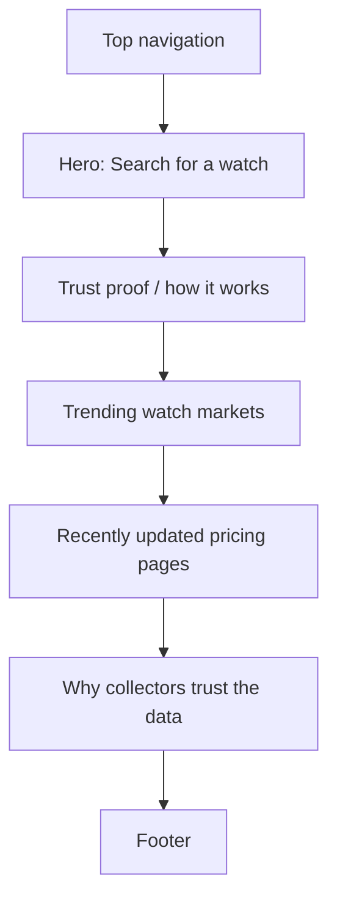
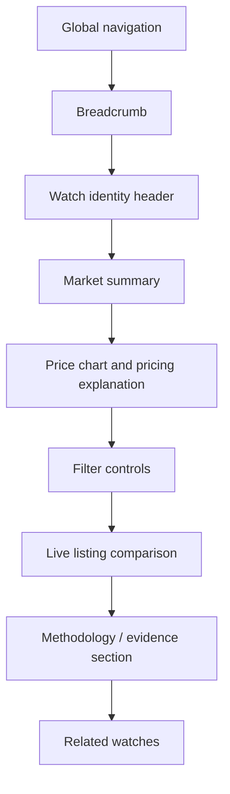

# Watch Market Website — Page Design Brief

## Design direction: financial clarity for luxury watches

The site should feel like a blend of:

- A premium watch magazine
- A modern financial dashboard
- A trustworthy comparison tool

It should **not** look like a generic luxury e-commerce site. The main question users need answered is:

> Is this watch priced well, and what is the evidence?

The interface should make that answer feel immediate, confident, and easy to verify.

---

## 1. Brand personality

### Desired feeling

The interface should feel:

- **Premium**, without being flashy
- **Analytical**, without feeling cold
- **Trustworthy**, never sales-driven
- **Clean and calm**, even with substantial market data
- **Collector-aware**, using precise terminology without being intimidating

Visual inspiration:

- Sotheby's visual restraint
- Bloomberg-style information hierarchy
- Apple-level spacing and polish
- A modern watch collector's desk

### Avoid

Avoid visual patterns that make the product seem like:

- A cheap deal aggregator
- A flashy crypto or investing app
- A generic marketplace
- A watch dealer trying to sell inventory
- A crowded spreadsheet
- A black-and-gold luxury cliché

Too much black, gold, gradients, or dramatic animation reduces trust. The product should look evidence-led rather than promotional.

---

## 2. Visual identity

### Primary color palette

Use a warm, editorial off-white background rather than pure white.

| Role | Color | Use |
|---|---:|---|
| Main page background | `#F7F6F2` | Warm ivory page background |
| Surface/card background | `#FFFFFF` | Cards, tables, popovers |
| Primary text | `#1A1A18` | Headings, prices, key content |
| Secondary text | `#696862` | Metadata and supporting labels |
| Border | `#E6E4DE` | Card, table, and input borders |
| Deep green | `#1F5B48` | Potential-deal indicators, primary actions |
| Pale green | `#E6F1EC` | Positive badge backgrounds |
| Amber | `#A96816` | Above-range/caution state |
| Pale amber | `#FCF1DC` | Caution badge backgrounds |
| Red / berry | `#9B3436` | Clearly above-market state |
| Pale red | `#F8E7E7` | Overpriced badge backgrounds |
| Slate blue | `#36566C` | Neutral/fair status and charts |
| Pale blue | `#E8F0F4` | Neutral status backgrounds |

### Accent color

Use muted deep green (`#1F5B48`) as the main brand accent.

Use it for:

- Main buttons
- Active tabs
- Potential-deal elements
- Chart highlights
- Selected filters
- Small decorative rule lines

Use green sparingly. It must mean a genuinely favorable finding, not simply a clickable interface element.

---

## 3. Typography

Typography should communicate premium editorial quality and numerical confidence.

### Headings: editorial serif

Use a refined serif for major headings:

- DM Serif Display — recommended
- Cormorant Garamond
- Lora
- Libre Baskerville

Use it for:

- Main page titles
- Watch model names
- Marketing headlines
- Optionally, large market-price figures

Example:

> Rolex Submariner Date  
> Reference 126610LN

### Interface and data: clean sans-serif

Use a highly readable sans-serif for all UI and data:

- Inter — recommended
- Manrope
- DM Sans
- IBM Plex Sans

Use it for navigation, price tables, filters, buttons, charts, metadata, and explanations.

### Type scale

| Element | Suggested size |
|---|---:|
| Homepage headline | 52–64px desktop |
| Model name | 36–48px desktop |
| Main fair-price figure | 42–52px |
| Section title | 24–30px |
| Listing price | 18–22px |
| Standard body text | 14–16px |
| Metadata/labels | 12–13px |
| Table labels | 11–12px, uppercase with tracking |

Use small uppercase labels selectively, such as:

> MARKET RANGE  
> ACTIVE LISTINGS  
> DATA CONFIDENCE

---

## 4. Homepage layout

The homepage should get users to a specific watch model in seconds.



### Top navigation

Keep it minimal.

**Left**

- Wordmark/logo

**Center or right**

- Explore Watches
- Market Trends
- How It Works

**Far right**

- Search icon
- Sign in
- `Track a watch` button

#### Navigation styling

- White or ivory background
- Fine bottom border
- Height around 72–80px
- Logo in dark charcoal
- One dark green outlined or filled CTA

Do not fill navigation with many categories. It should feel focused.

### Homepage hero

The hero should occupy roughly 65–75% of the first screen.

#### Left column

- Small eyebrow label: `LIVE WATCH MARKET DATA`
- Main headline: **Know what a watch is worth — today.**
- Supporting copy: *Compare live dealer listings, see the current market range, and spot prices that stand out.*
- Large search field

#### Right column

- A clean oversized watch image or curated image composition
- Only subtle data-card overlays, not a cluttered dashboard

### Search field

This is the most important homepage element.

```text
⌕  Search brand, model, or reference number
   Try “Rolex 126610LN” or “Omega Speedmaster 310.30”
```

Design characteristics:

- White background
- 1px neutral border
- Soft shadow only on focus
- Height: 60–68px
- Corner radius: 12–14px
- Search icon at left
- Clear type hierarchy
- Suggestion dropdown with image thumbnails

### Hero data card

Place one elegant card overlapping the watch image:

```text
ROLEX SUBMARINER DATE
Reference 126610LN

€11,800 – €12,650
Observed asking-price range

31 active listings  ·  Updated 18 min ago
```

This demonstrates the product before the user searches.

---

## 5. Core model page

This is the page users will return to repeatedly. It should feel like a beautiful, evidence-first market terminal.



### A. Watch identity header

Keep this section editorial rather than commercial.

#### Two-column layout

**Left: watch image**

- Large square or near-square image area
- Neutral cream/light-gray background
- One product image rather than a busy gallery
- Optional note: “Real listing photos below”

**Right: model information**

```text
ROLEX

Submariner Date

Reference 126610LN
Oystersteel · Black dial · Oyster bracelet

Follow market    Share
```

Then below:

```text
31
Active tracked listings

€11,800–€12,650
Observed price range

High
Data confidence
```

The market range must be more visually dominant than the watch name. The model name provides context; the market range answers the core question.

### B. Market summary card

This is the visual centre of the page.

Use a large white horizontal card with a subtle border and 24–32px internal padding.

```text
CURRENT OBSERVED MARKET RANGE

€11,800 — €12,650

Typical comparable asking price: €12,220

↑ 2.8% over the last 90 days
Based on 31 active non-duplicate listings
Last refreshed 18 minutes ago
```

#### Layout

**Left: primary pricing**

- Uppercase muted-gray label
- Large bold price range
- Supporting median/typical price
- Small listing-count and timestamp text

**Middle: range visualization**

```text
€10,800      €11,800        €12,220        €12,650      €13,800
─────────────[───────────────●──────────────]─────────────
             Low range       Typical         High range
```

Use:

- Soft gray full line
- Muted green range band
- Dark green centre marker
- Small labels below

**Right: confidence and trend**

```text
HIGH CONFIDENCE
● 31 active listings
● 9 tracked sources
● 87% refreshed in 48h
```

Use icons and text, not coloured dots alone.

### C. “What this means” panel

Place it immediately below the market summary.

```text
How to read this market

Listings priced below €11,800 may be worth a closer look.
Listings between €11,800 and €12,650 are within the observed comparable range.
Prices above €12,650 are higher than most comparable listings.
```

Use a soft blue-gray background rather than green. The panel is explanatory, not promotional.

Use three compact columns:

| Potential deal | Fair range | Above market |
|---|---|---|
| Below €11,800 | €11,800–€12,650 | Above €12,650 |

Each column can have a subtle coloured icon with neutral text.

---

## 6. Price chart design

Avoid charts that look like trading software unless the user specifically chooses an advanced market view.

### Default chart: price distribution

The default should show where current listings sit.

```text
€10,500  ───────────────────────────────────────────── €14,000

● ●    ● ● ●    ● ● ● ● ● ● ●  ● ●    ●      ●
       └──── observed fair range ────┘
                  ● typical price
```

Each dot represents one active non-duplicate listing.

On hover, reveal:

```text
€11,450
Dealer name
Excellent condition
Box & papers
Germany
```

This helps users see whether a listing genuinely sits outside the market.

### Chart toggle options

Use simple segmented controls:

- `Current listings`
- `90-day trend`
- `Supply`

Do not show all chart types simultaneously.

### 90-day trend chart

Use:

- A soft green market-range band
- Dark charcoal median line
- Minimal grid lines
- Tooltips with exact values and methodology context

The chart should answer:

- Has the price moved?
- Is supply increasing?
- Is this a normal price today?

---

## 7. Live listings section

This is the core of the product: comparing actual watches.

### Section header

```text
Live listings
31 tracked listings matching this reference

[All listings] [Potential deals 6] [Fair price 18] [Above market 7]
```

Use status filters as tabs or chips, not separate pages.

### Desktop: table-card hybrid

Use a listing table with image-led rows. A pure table is efficient but dry; a card grid is beautiful but difficult to compare.

| Watch | Price | Price position | Condition & set | Seller | Location | Updated |
|---|---:|---|---|---|---|---|

Example row:

```text
[photo]  Rolex Submariner Date
         126610LN · 2023 · Full set

         €11,450
         €770 below typical

         Potential deal
         6.3% below comparable median

         Excellent
         Box & papers

         Dealer name
         Source name

         Germany
         Updated 2h ago     →
```

### Photo styling

- 88–110px square on desktop
- 72px square on mobile
- Neutral gray or cream background
- Corner radius: 8–10px
- Keep authentic dealer photography visible
- Optional “multiple photos” indicator

### Price-position badges

Do not use only broad labels like “Deal” or “Overpriced.” Make the result specific.

#### Potential deal

```text
↓ 6.3% below typical
Potential deal
```

- Pale green background
- Dark green text
- Small downward arrow
- No neon green

#### Fair price

```text
Within observed range
Fair price
```

- Pale slate-blue background
- Slate-blue text
- Neutral and reassuring

#### Above market

```text
↑ 9.4% above typical
Above market
```

- Pale amber for mild cases
- Pale red only for clearly extreme cases

#### Insufficient data

```text
Limited comparable data
```

- Light gray background
- No emotionally loaded colour

### Preferred label language

Use:

- Potential deal
- Below comparable range
- Within observed range
- Above comparable range
- Limited market evidence

Avoid:

- Buy now
- Steal
- Bad price
- Rip-off
- Guaranteed bargain

---

## 8. Listing detail drawer

When someone clicks a listing row, open a right-side detail drawer or expanded panel before sending them to the original source.

```text
[Large real listing photo]

Rolex Submariner Date
Reference 126610LN

€11,450
Potential deal · 6.3% below typical

────────────────────────

Why this stands out

This price is €770 below the typical comparable asking price.
It is within the same condition and full-set category as 18 similar listings.

Comparable range
€11,800–€12,650

────────────────────────

Listing details

Condition       Excellent
Year            2023
Box             Included
Papers          Included
Seller          Dealer name
Location        Munich, Germany
Source          Marketplace / dealer site
Last checked    2 hours ago

[View original listing ↗]
```

The “Why this stands out” section should be tinted:

- Pale green for potential deals
- Pale blue for fair listings
- Pale amber/red for above-market listings

---

## 9. Filters and sorting

Filters should feel polished and effortless, not like a database query form.

### Filter bar

Keep it directly above live listings and make it sticky while scrolling that section.

```text
[Location ▾] [Condition ▾] [Box & papers ▾] [Price ▾] [Seller type ▾] [More filters]
                                              Sort: Best value ▾
```

### Filter style

- White pill buttons
- Thin gray border
- 36–40px height
- Small chevron
- Dark text
- Selected filters: pale green with dark green border/text
- Display `Clear filters` only after filters are selected

### Essential filters

Display first:

- Location
- Condition
- Box & papers
- Price
- Seller type

Place under `More filters`:

- Year
- Material
- Dial
- Bracelet
- Source
- Tax status
- Recently updated
- Dealer warranty
- Availability
- Only listings with multiple photos

### Sort options

Default: **Best value**

Other options:

- Lowest price
- Highest price
- Most recently updated
- Closest to market median
- Newest listing
- Highest confidence

Tooltip for `Best value`:

> Sorts by price position after comparing condition, completeness, freshness, and market relevance.

---

## 10. Mobile page design

The mobile experience must not be a compressed desktop table.

### Mobile priority order

1. Watch model
2. Market range
3. Deal/fair/above-market explanation
4. Filterable listing cards
5. Source verification
6. Charts and deeper details

### Mobile market summary

Use a vertically stacked card:

```text
ROLEX SUBMARINER DATE
Reference 126610LN

€11,800–€12,650
Observed market range

€12,220 typical asking price
31 active listings · High confidence

[View live listings]
```

Keep a simplified range bar.

### Mobile listing card

```text
[Large watch photo]

Rolex Submariner Date
126610LN · 2023 · Full set

€11,450

[↓ 6.3% below typical]
Potential deal

Excellent · Box & papers
Dealer name · Germany
Checked 2 hours ago

[View analysis]     [Original listing ↗]
```

Each card should make the photo, price, classification, facts, and source action immediately visible.

### Sticky mobile action bar

For a model page:

```text
31 live listings     [Filter]   [Sort]
```

For an open listing:

```text
[Save listing]             [View original listing ↗]
```

---

## 11. Watchlist and saved-search design

The best retention feature is a simple market watchlist.

### Watchlist card

```text
Rolex Submariner Date
126610LN

€11,800–€12,650
↑ 2.8% in 90 days

31 listings
6 potential deals

Last updated 18 min ago
```

Use a small minimalist sparkline rather than a large chart.

### Alert preferences

Use plain language:

```text
Notify me when:

☐ A listing is at least 5% below the typical range
☐ The market range moves by more than 3%
☐ New listings appear
☐ Listings with box and papers appear
```

---

## 12. Homepage supporting sections

### “How it works”

Avoid generic icon blocks. Use a simple three-step story:

```text
01
We collect visible market listings

02
We compare like-for-like watches

03
You see where each price sits
```

Each step should have a small visual:

- Listing cards
- Comparison/filter illustration
- Price-range chart

### “Markets people are watching”

Use a three-column grid on desktop:

```text
[watch image]
Omega Speedmaster Professional
€5,800–€6,450
42 active listings
Updated 42 min ago
```

Each card should show:

- Clean product image area
- Model/reference
- Price range
- Trend
- Active listing count
- Small arrow on hover

Do not show “deals” on the homepage. Show market summaries; deal discovery belongs on model pages.

---

## 13. Image use

### Product photography

Real photos are a key strength. Let them look real.

Use:

- Dealer photos with natural lighting
- Visible evidence of watch/bracelet condition
- Box and papers evidence where available
- Large images in the listing drawer

Avoid:

- Over-retouched editorial imagery everywhere
- Generic stock watch images
- Dark, moody imagery that hides the watch
- Excessive image carousels

### Image backgrounds

Use mostly:

- `#F1F0EB`
- `#F7F6F2`
- Very light gray

This keeps images from multiple dealers cohesive without falsely implying they were photographed in the same studio.

---

## 14. Trust-signal design

Trust should be built into every page rather than hidden in a separate legal page.

### Under every key value

Show freshness and evidence context:

```text
Based on 31 non-duplicate active listings
Last refreshed 18 minutes ago
```

### Evidence icon

Use a subtle document/check icon beside:

> Evidence available

The detail view should reveal:

- Number of listings used
- Markets included
- Date range
- Excluded items
- Methodology version

### “Last checked” status

| Status | Visual |
|---|---|
| Checked within 24h | Small green dot + “Checked 2h ago” |
| Checked within 7 days | Neutral gray dot + date |
| Older than 7 days | Amber dot + “May no longer be available” |
| Unavailable | Gray label, retained only for historical context |

Do not hide stale listings silently; distinguish them clearly.

---

## 15. Spacing, borders, and interaction

### Spacing system

| Use | Spacing |
|---|---:|
| Micro spacing | 4px |
| Compact spacing | 8px |
| Control spacing | 12px |
| Card internals | 16px |
| Section elements | 24px |
| Card/section padding | 32px |
| Major page sections | 48–80px |

The design should breathe. Avoid packing information tightly against borders.

### Border radius

| Component | Radius |
|---|---:|
| Buttons / controls | 8px |
| Inputs | 10–12px |
| Cards | 14–16px |
| Image frames | 10–12px |
| Status badges | Full pill |

Avoid huge rounded cards throughout the product. A serious research product should not feel toy-like.

### Shadows

Use shadows lightly:

- Default cards: no shadow; use borders
- Hovered listing rows/cards: soft shadow
- Search dropdowns, drawers, and modals: subtle shadow
- Never use heavy floating shadows

### Motion

Keep animation short and functional:

- 150–250ms hover/focus transitions
- Gentle listing-row highlight on hover
- Filter chip state transitions
- Chart tooltip fade-in
- Soft side-panel slide-in

Avoid watch rotations, parallax hero imagery, dramatic number counters, or celebratory deal animations.

---

## 16. Model-page desktop wireframe

```text
────────────────────────────────────────────────────────────────────────
LOGO                 Explore watches   Market trends   How it works
                                             Search   Sign in  [Track watch]
────────────────────────────────────────────────────────────────────────

Home / Rolex / Submariner / 126610LN

[Large watch image]       ROLEX
                          Submariner Date
                          Reference 126610LN
                          Oystersteel · Black dial · Oyster bracelet

                          [Follow market]  [Share]

                          31 Active listings    High confidence
                          Updated 18 minutes ago

────────────────────────────────────────────────────────────────────────

CURRENT OBSERVED MARKET RANGE

€11,800 — €12,650                         HIGH CONFIDENCE
Typical asking price: €12,220              31 listings
                                           9 sources
[range bar with median marker]             87% checked within 48h

────────────────────────────────────────────────────────────────────────

How to read this market
Potential deal         Fair range              Above market
Below €11,800          €11,800–€12,650         Above €12,650

────────────────────────────────────────────────────────────────────────

Market activity                              [Current listings] [90 day trend] [Supply]

[Wide, calm listing distribution chart]

────────────────────────────────────────────────────────────────────────

Live listings                                              Sort: Best value ▾
[Location ▾] [Condition ▾] [Box & papers ▾] [Price ▾] [More filters ▾]

[Photo]  Submariner Date      €11,450       Potential deal       Excellent       Dealer
         2023 · Full set      €770 below    ↓ 6.3% below         Box & papers    Germany
                                                                  Updated 2h ago

[Photo]  Submariner Date      €12,180       Fair price            Very good      Dealer
         2022 · Full set                     Within range          Full set       France

[Photo]  Submariner Date      €13,750       Above market          Unworn         Dealer
         2024 · Full set                     ↑ 12.5% above         Full set       Italy
────────────────────────────────────────────────────────────────────────
```

---

## 17. Primary visual rule

Every page should follow this hierarchy:

1. **What watch is this?**
2. **What is the current comparable price range?**
3. **How much evidence supports that range?**
4. **Where does each actual listing sit?**
5. **Can the user verify the source?**

If decorative images, marketing copy, or promotional content appear before these answers, the page is failing.

---

## 18. Final design brief

> Create a refined, evidence-first watch-market interface. Use warm ivory backgrounds, charcoal typography, muted deep green accents, and real listing photography. Pair a classic editorial serif for watch names with a modern sans-serif for pricing data. Make the current market range the visual centerpiece, keep deal labels cautious and evidence-backed, and design listing comparison as a clean image-led table. The experience should feel premium, calm, transparent, and more like a trusted market-research product than a watch marketplace.
